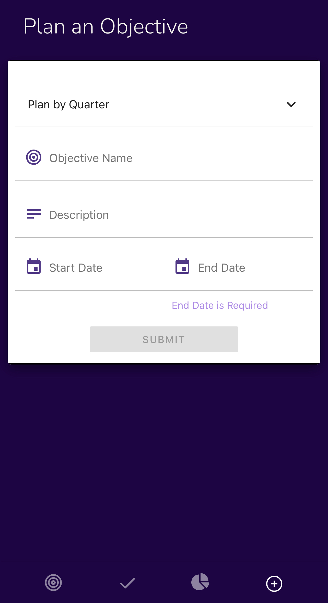
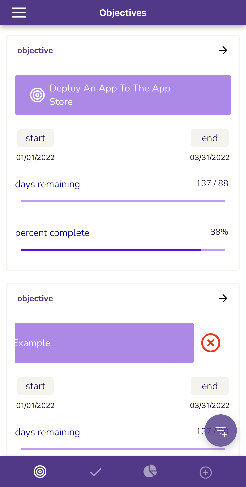
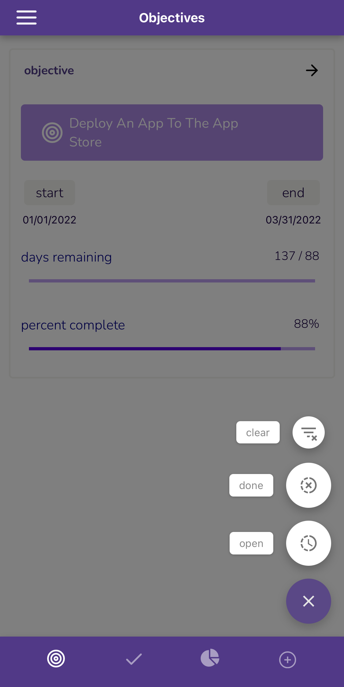
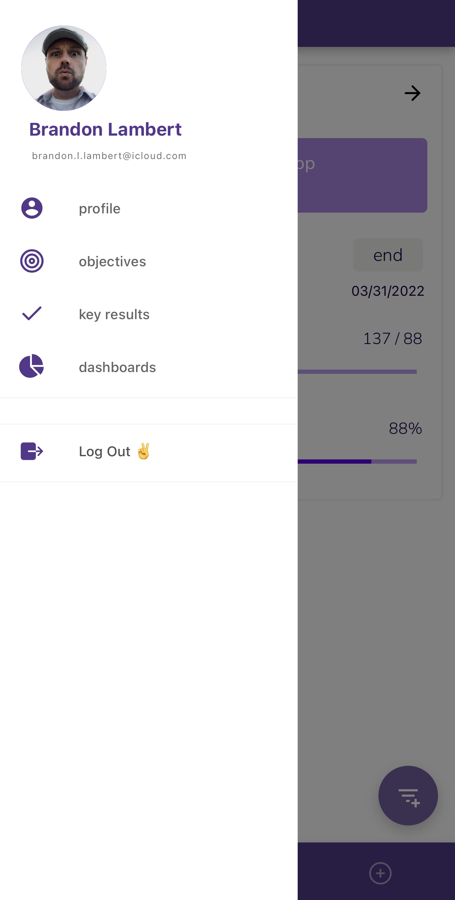

# React Native OKR API

My Goal is to create an OKR user interface that is available wherever I am.

The first step of that goal, is to get the OKR working on mobile!

I've decided to use React Native to leverage my existing JavaScript skills (from Node.JS)

The backend can be found here: <https://github.com/udemonia/okr-api>

## Tech Stack

I'm using

- expo

- React Navigation V5

> Nesting the routers has gotten me the slide open side view, tab view, and multiple stack views - all within the same application

- Reanimated2

> get the animations off of the JavaScript thread, ensuring a smooth, 60fps experience.

- JWT

> Here, I'm getting the JWT the server is responding with and using if for subsequent calls - On log out, I'm removing the screen stack and dropping folks at the login screen again

- React Native Context

> I might update this to use redux - depending upon need

## Slide to Delete

Implemented with Reanimated2 - From the list view, swipe an OKR title left and select the X button to delete

Currently, we're interpolating the opacity of the x symbol with the x axis - snapping when we've reached a critical threshold.

